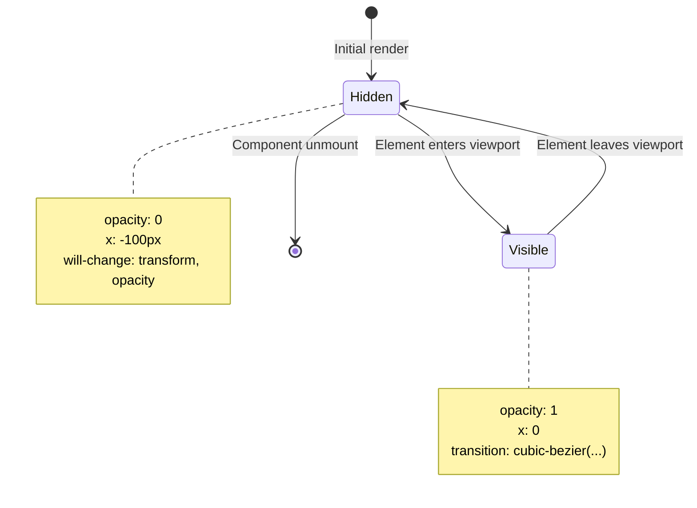

# Plano de Implementação Técnica: Scroll-Triggered Animations
**Referência**: Motion.dev - Scroll-triggered animation  
**Stack**: Next.js App Router + React + TypeScript + Tailwind CSS + Motion (Framer Motion)  
**Data**: 2025-01-22  
**Autor**: @motion-engineer + @frontend-specialist

---

## 📋 Resumo Executivo

Este documento traduz a experiência visual da referência [Motion Scroll-triggered](https://examples.motion.dev/js/scroll-triggered) para um plano técnico executável na stack Next.js App Router. O foco exclusivo é na **física das animações**, **comportamento scroll-triggered** e **padrões de implementação**, ignorando deliberadamente cores, tipografia e layout visual da referência.

### Escopo Confirmado
- ✅ Scroll-triggered animations com entrada/saída de viewport
- ✅ Transições de opacity + translateX com easing customizado
- ✅ Estados de animação reversível (enter/leave)
- ✅ Estrutura modular para componentes reutilizáveis
- ✅ Suporte a `prefers-reduced-motion` e fallbacks

### Fora de Escopo (Conforme Diretrizes)
- ❌ Paleta de cores, tipografia, grid system da referência
- ❌ Custom cursor, WebGL, parallax complexo (não presentes na referência)
- ❌ Conteúdo textual específico

---

## 🔍 Leitura Visual Estrutural: Fatos vs Inferências

### ✅ Observações Visuais Confirmadas (Browser Subagent)
```
1. Estrutura: 4 seções full-viewport (100vh cada)
2. Estado inicial dos elementos <pre>:
   - opacity: 0
   - transform: translateX(-100px)
   - position: relative para transform
3. Gatilho: Intersection Observer via inView()
4. Animação de entrada:
   - opacity: 0 → 1
   - x: -100px → 0
   - duration: 0.9s
   - easing: cubic-bezier(0.17, 0.55, 0.55, 1)
5. Animação de saída (cleanup):
   - Reverte para estado inicial
   - Mesma duração, easing linear implícito
6. Comportamento: Cada elemento anima independentemente ao entrar/sair
```

### 🔶 Inferências Técnicas Plausíveis
```
1. Performance: Uso de transform + opacity (composited layers)
2. Acessibilidade: Respeito a prefers-reduced-motion necessário
3. SSR Compatibility: Animações devem iniciar apenas no client-side
4. Reutilização: Padrão ideal para hook customizado useScrollTrigger
5. Debug: Logging de viewport events útil para desenvolvimento
```

### ⚠️ Pontos para Validação Manual
```
1. Threshold exato do Intersection Observer (padrão: 0.1?)
2. Comportamento em mobile: touch scroll vs mouse wheel
3. Performance com múltiplos elementos simultâneos em viewport
4. Interação com outros scroll-linked animations na mesma página
```

---

## 🗺️ Mapa de Animações: Física e Gatilhos

### Tabela de Parâmetros de Motion

| Propriedade | Valor Referência | Adaptação Framer Motion | Notas |
|------------|-----------------|------------------------|-------|
| **Trigger** | `inView(selector, callback)` | `whileInView` prop ou `useInView` hook | React-first approach |
| **Initial State** | `opacity: 0, x: -100` | `initial={{ opacity: 0, x: -100 }}` | Usar motion components |
| **Animate To** | `opacity: 1, x: 0` | `whileInView={{ opacity: 1, x: 0 }}` | Viewport-triggered |
| **Duration** | `0.9` seconds | `transition={{ duration: 0.9 }}` | Consistent timing |
| **Easing** | `[0.17, 0.55, 0.55, 1]` | `ease: [0.17, 0.55, 0.55, 1]` | Cubic bezier string |
| **Exit Behavior** | Cleanup function | `viewport={{ once: false }}` + conditional | Reversible by default |
| **Viewport Margin** | Default (0%) | `viewport={{ margin: "-100px" }}` | Optional fine-tuning |

### Diagrama de Estados da UI



### Comportamento Responsivo
```typescript
// Mobile-first breakpoints para ajustes de animação
const MOTION_BREAKPOINTS = {
  mobile: { max: 767 },    // Reduzir distance: -50px → 0
  tablet: { min: 768, max: 1023 }, // Manter referência
  desktop: { min: 1024 }   // Full effect: -100px → 0
}

// Exemplo de adaptação por breakpoint
const getXInitial = (isMobile: boolean) => isMobile ? -50 : -100
```

---

## 🏗️ Arquitetura Recomendada: Next.js App Router

### Estrutura de Pastas Escalável
```
src/
├── app/
│   ├── (marketing)/
│   │   ├── layout.tsx          # Layout com providers de motion
│   │   ├── page.tsx            # Página principal com seções
│   │   ├── loading.tsx         # Skeleton para scroll sections
│   │   ├── error.tsx           # Fallback para erros de carregamento
│   │   └── not-found.tsx       # 404 customizado
│   ├── api/
│   │   └── assets/
│   │       └── route.ts        # Proxy para Supabase Storage (opcional)
│   └── globals.css             # Tailwind + tokens de motion
│
├── components/
│   ├── ui/
│   │   ├── scroll-section/
│   │   │   ├── index.tsx       # Componente principal
│   │   │   ├── types.ts        # TypeScript interfaces
│   │   │   ├── motion.config.ts # Tokens de animação centralizados
│   │   │   └── variants.ts     # Framer Motion variants reutilizáveis
│   │   └── providers/
│   │       └── motion-provider.tsx # Context para configurações globais
│   ├── features/
│   │   └── scroll-triggered/
│   │       ├── useScrollTrigger.ts # Hook customizado
│   │       ├── ScrollText.tsx  # Texto com animação scroll-triggered
│   │       └── ScrollContainer.tsx # Wrapper com viewport config
│   └── primitives/
│       ├── MotionDiv.tsx       # motion.div com defaults da marca
│       └── withReducedMotion.tsx # HOC para acessibilidade
│
├── lib/
│   ├── motion/
│   │   ├── constants.ts        # Easings, durations, breakpoints
│   │   ├── utils.ts            # Helpers: clamp, mapRange, etc.
│   │   └── types.ts            # Shared motion types
│   ├── supabase/
│   │   └── client.ts           # Cliente Supabase (assets)
│   └── firebase/
│       └── config.ts           # Config Firebase Hosting (build-time)
│
├── hooks/
│   ├── useViewport.ts          # Detecta viewport size + reduced-motion
│   ├── useScrollProgress.ts    # Scroll progress para efeitos linked
│   └── usePrefersReducedMotion.ts # Media query hook
│
├── styles/
│   ├── tokens.ts               # Design tokens: spacing, radius, motion
│   └── animations.css          @keyframes fallbacks (se necessário)
│
└── types/
    └── motion.d.ts             # Augmentations para TypeScript
```

### Separação Server/Client Components
```typescript
// ✅ Server Component: app/(marketing)/page.tsx
export default async function MarketingPage() {
  // Dados estáticos ou fetch server-side
  const sections = await getScrollSections() // Supabase/DB
  
  return (
    <main>
      {sections.map(section => (
        <ScrollSection 
          key={section.id}
          content={section.content}
          // Props leves para client component
        />
      ))}
    </main>
  )
}

// ✅ Client Component: components/features/scroll-triggered/ScrollText.tsx
'use client'

import { motion, useInView } from 'motion/react' // Motion for React
import { useRef } from 'react'

export function ScrollText({ children, delay = 0 }: { children: React.ReactNode, delay?: number }) {
  const ref = useRef<HTMLDivElement>(null)
  const isInView = useInView(ref, { once: false, margin: "-100px" })
  
  return (
    <motion.div
      ref={ref}
      initial={{ opacity: 0, x: -100 }}
      animate={isInView ? { opacity: 1, x: 0 } : { opacity: 0, x: -100 }}
      transition={{ 
        duration: 0.9, 
        ease: [0.17, 0.55, 0.55, 1],
        delay 
      }}
    >
      {children}
    </motion.div>
  )
}
```

---

## 🧩 Estratégia de Componentes: Reutilização e Composição

### Component Hierarchy
```
ScrollPage (layout wrapper)
├── ScrollProvider (context for global motion config)
├── ScrollSection (100vh container)
│   ├── ScrollTriggerBoundary (viewport config)
│   │   └── ScrollText (animated content)
│   └── ScrollFallback (static content if JS disabled)
└── ScrollProgressIndicator (optional: scroll-linked bar)
```

### Padrão de Composição Recomendado
```typescript
// components/ui/scroll-section/index.tsx
import { MotionDiv } from '@/components/primitives/MotionDiv'
import { ScrollText } from '@/components/features/scroll-triggered/ScrollText'
import { motionConfig } from './motion.config'

interface ScrollSectionProps {
  children: React.ReactNode
  index: number
  className?: string
}

export function ScrollSection({ children, index, className }: ScrollSectionProps) {
  // Stagger children animation based on index
  const delay = index * motionConfig.staggerDelay
  
  return (
    <MotionDiv
      section
      className={className}
      initial="hidden"
      whileInView="visible"
      viewport={{ 
        once: false, 
        margin: motionConfig.viewportMargin,
        amount: motionConfig.viewportAmount 
      }}
    >
      <ScrollText delay={delay}>
        {children}
      </ScrollText>
    </MotionDiv>
  )
}
```

### Hook Customizado: useScrollTrigger
```typescript
// hooks/useScrollTrigger.ts
import { useInView } from 'motion/react'
import { useRef, useEffect } from 'react'

interface UseScrollTriggerOptions {
  once?: boolean
  margin?: string
  onEnter?: () => void
  onLeave?: () => void
}

export function useScrollTrigger<T extends HTMLElement = HTMLElement>(
  options: UseScrollTriggerOptions = {}
) {
  const { 
    once = false, 
    margin = "-100px",
    onEnter,
    onLeave 
  } = options
  
  const ref = useRef<T>(null)
  
  const isInView = useInView(ref, {
    once,
    margin,
    // Callbacks para side-effects
    onEnter: () => onEnter?.(),
    onLeave: () => onLeave?.(),
  })
  
  // Cleanup: logging para debug em dev
  useEffect(() => {
    if (process.env.NODE_ENV === 'development') {
      console.log(`[ScrollTrigger] Element ${isInView ? 'entered' : 'left'} viewport`)
    }
  }, [isInView])
  
  return { ref, isInView }
}
```

---

## 🔄 Estados de UI: Loading, Empty, Error

### Estratégia por Camada

| Estado | Implementação | Quando Usar | Fallback |
|--------|--------------|-------------|----------|
| **Loading** | `loading.tsx` + Skeleton components | Durante fetch de dados ou lazy-load de assets pesados | Static placeholder com mesma estrutura |
| **Empty** | Componente `EmptyState` com CTA | Quando lista de seções está vazia ou sem dados | Mensagem amigável + botão de refresh |
| **Error** | `error.tsx` + retry logic | Falha no fetch, erro de renderização, JS desabilitado | Versão estática sem animações |
| **Reduced Motion** | `prefers-reduced-motion` media query | Usuário com preferência por menos movimento | Animações instantâneas (duration: 0.01) |

### Exemplo: Error Boundary com Fallback
```typescript
// app/(marketing)/error.tsx
'use client'

import { useEffect } from 'react'
import { StaticScrollSection } from '@/components/features/scroll-triggered/StaticScrollSection'

export default function ScrollError({
  error,
  reset,
}: {
  error: Error & { digest?: string }
  reset: () => void
}) {
  useEffect(() => {
    // Log error para monitoring (Sentry, etc)
    console.error('Scroll animation error:', error)
  }, [error])
  
  return (
    <div className="min-h-screen flex items-center justify-center p-4">
      <div className="text-center space-y-4">
        <h2 className="text-xl font-semibold">
          Algo não funcionou nas animações
        </h2>
        <p className="text-muted-foreground">
          Exibindo versão estática para garantir acessibilidade
        </p>
        
        {/* Fallback estático: mesmo conteúdo, sem motion */}
        <StaticScrollSection />
        
        <button
          onClick={reset}
          className="px-4 py-2 bg-primary text-primary-foreground rounded hover:opacity-90 transition"
        >
          Tentar novamente
        </button>
      </div>
    </div>
  )
}
```

### Loading Skeleton Pattern
```typescript
// components/ui/scroll-section/skeleton.tsx
export function ScrollSectionSkeleton({ count = 4 }: { count?: number }) {
  return (
    <>
      {Array.from({ length: count }).map((_, i) => (
        <section 
          key={i} 
          className="h-screen flex items-center justify-center"
          aria-busy="true"
          aria-label="Carregando seção"
        >
          <div className="w-48 h-8 bg-muted animate-pulse rounded" />
        </section>
      ))}
    </>
  )
}
```

---

## 🎨 Design Tokens: Motion, Spacing, Breakpoints

### Tokens Centralizados (lib/motion/constants.ts)
```typescript
// lib/motion/constants.ts
export const MOTION_TOKENS = {
  // Timing
  duration: {
    fast: 0.3,
    normal: 0.6,
    slow: 0.9,    // Referência: scroll-triggered
    slower: 1.2,
  },
  
  // Easing curves (cubic-bezier)
  ease: {
    standard: [0.4, 0.0, 0.2, 1],
    enter: [0.17, 0.55, 0.55, 1],  // Referência: scroll-triggered
    exit: [0.16, 1, 0.3, 1],
    bounce: [0.68, -0.55, 0.265, 1.55],
  },
  
  // Distance for slide animations
  distance: {
    xs: 20,
    sm: 50,      // Mobile breakpoint
    md: 100,     // Desktop referência
    lg: 150,
  },
  
  // Viewport configuration
  viewport: {
    margin: "-100px",  // Trigger antes de entrar totalmente
    amount: "some",    // "some" = qualquer parte visível
  },
  
  // Stagger for multiple children
  stagger: {
    delay: 0.1,
    direction: "normal" as const,
  },
  
  // Reduced motion fallback
  reducedMotion: {
    duration: 0.01,
    ease: "linear" as const,
  },
} as const

// Breakpoints para adaptação responsiva
export const BREAKPOINTS = {
  mobile: 767,
  tablet: 1023,
  desktop: 1024,
} as const

// Type exports para TypeScript
export type MotionDuration = keyof typeof MOTION_TOKENS.duration
export type MotionEase = keyof typeof MOTION_TOKENS.ease
export type MotionDistance = keyof typeof MOTION_TOKENS.distance
```

### Integração com Tailwind (tailwind.config.ts)
```typescript
// tailwind.config.ts - extensão para motion tokens
import type { Config } from 'tailwindcss'

const config: Config = {
  theme: {
    extend: {
      // Motion duration utilities
      transitionDuration: {
        'motion-fast': '300ms',
        'motion-normal': '600ms', 
        'motion-slow': '900ms', // Referência
      },
      // Custom easings via CSS variables
      transitionTimingFunction: {
        'motion-enter': 'cubic-bezier(0.17, 0.55, 0.55, 1)',
      },
      // Spacing tokens alinhados com motion distance
      translate: {
        'motion-sm': '50px',
        'motion-md': '100px', // Referência
        'motion-lg': '150px',
      },
    },
  },
  // ... resto da config
}
export default config
```

---

## 🚀 Plano de Implementação: Passos Executáveis

### Fase 1: Setup e Configuração (Dia 1)
```bash
# 1.1 Instalar dependências de motion
npm install motion @types/react @types/react-dom

# 1.2 Criar estrutura de tokens e constants
touch src/lib/motion/constants.ts src/lib/motion/types.ts

# 1.3 Configurar Tailwind com motion tokens
# Editar tailwind.config.ts conforme seção anterior

# 1.4 Criar MotionProvider para configurações globais
touch src/components/ui/providers/motion-provider.tsx
```

### Fase 2: Componentes Base (Dia 2)
```bash
# 2.1 Criar primitive MotionDiv com defaults da marca
touch src/components/primitives/MotionDiv.tsx

# 2.2 Implementar hook useScrollTrigger
touch src/hooks/useScrollTrigger.ts

# 2.3 Criar componente ScrollText com variants
touch src/components/features/scroll-triggered/ScrollText.tsx

# 2.4 Criar ScrollSection wrapper
touch src/components/ui/scroll-section/index.tsx
```

### Fase 3: Integração App Router (Dia 3)
```bash
# 3.1 Configurar layout.tsx com providers
edit src/app/(marketing)/layout.tsx

# 3.2 Implementar página principal com seções
edit src/app/(marketing)/page.tsx

# 3.3 Adicionar loading.tsx e error.tsx
touch src/app/(marketing)/loading.tsx
touch src/app/(marketing)/error.tsx

# 3.4 Testar com dados mock antes de integrar Supabase
```

### Fase 4: Otimização e Acessibilidade (Dia 4)
```bash
# 4.1 Implementar suporte a prefers-reduced-motion
touch src/hooks/usePrefersReducedMotion.ts

# 4.2 Adicionar fallback estático para JS desabilitado
touch src/components/features/scroll-triggered/StaticScrollSection.tsx

# 4.3 Configurar Firebase Hosting para deploy
# Criar firebase.json e configurar build output

# 4.4 Testes de performance: Lighthouse, WebPageTest
```

### Fase 5: Validação e Documentação (Dia 5)
```bash
# 5.1 Criar Storybook stories para componentes de motion
# 5.2 Documentar API dos componentes em README.md
# 5.3 Validar com usuários: teste de usabilidade das animações
# 5.4 Ajustar thresholds baseado em feedback real
```

---

## 💻 Snippets Iniciais: Código Pronto para Uso

### 1. MotionDiv Primitive (src/components/primitives/MotionDiv.tsx)
```typescript
'use client'

import { motion, HTMLMotionProps } from 'motion/react'
import { MOTION_TOKENS } from '@/lib/motion/constants'
import { cn } from '@/lib/utils'

interface MotionDivProps extends HTMLMotionProps<'div'> {
  /** Aplica defaults de motion para seções de scroll */
  section?: boolean
  /** Desabilita animações para acessibilidade */
  disableMotion?: boolean
}

export function MotionDiv({ 
  className, 
  section = false,
  disableMotion = false,
  initial,
  animate,
  transition,
  ...props 
}: MotionDivProps) {
  // Merge com tokens padrão para modo section
  const defaultSectionProps = section ? {
    initial: { opacity: 0, y: 20 },
    whileInView: { opacity: 1, y: 0 },
    viewport: { margin: MOTION_TOKENS.viewport.margin },
    transition: { 
      duration: MOTION_TOKENS.duration.slow,
      ease: MOTION_TOKENS.ease.enter,
    },
  } : {}
  
  // Fallback para reduced motion
  const finalTransition = disableMotion 
    ? { duration: MOTION_TOKENS.reducedMotion.duration }
    : { ...defaultSectionProps.transition, ...transition }
  
  return (
    <motion.div
      className={cn('will-change-transform will-change-opacity', className)}
      initial={disableMotion ? undefined : (initial ?? defaultSectionProps.initial)}
      animate={disableMotion ? undefined : (animate ?? defaultSectionProps.whileInView)}
      transition={finalTransition}
      viewport={disableMotion ? undefined : defaultSectionProps.viewport}
      {...props}
    />
  )
}
```

### 2. Hook useScrollTrigger (src/hooks/useScrollTrigger.ts)
```typescript
'use client'

import { useInView, UseInViewOptions } from 'motion/react'
import { useRef, useCallback } from 'react'

export interface UseScrollTriggerReturn<T extends HTMLElement = HTMLElement> {
  ref: React.RefObject<T>
  isInView: boolean
  entry: IntersectionObserverEntry | null
}

export function useScrollTrigger<T extends HTMLElement = HTMLElement>(
  options: UseInViewOptions = {}
): UseScrollTriggerReturn<T> {
  const ref = useRef<T>(null)
  
  const { 
    once = false,
    margin = "-100px",
    amount = "some",
    ...rest 
  } = options
  
  const { ref: motionRef, isInView, entry } = useInView<T>({
    ref,
    once,
    margin,
    amount,
    ...rest,
  })
  
  // Merge refs para compatibilidade com outros hooks
  const combinedRef = useCallback((node: T | null) => {
    if (node) {
      ref.current = node
      motionRef(node)
    }
  }, [motionRef])
  
  return {
    ref: { ...ref, current: ref.current } as React.RefObject<T>,
    isInView,
    entry,
  }
}
```

### 3. ScrollText Component (src/components/features/scroll-triggered/ScrollText.tsx)
```typescript
'use client'

import { MotionDiv } from '@/components/primitives/MotionDiv'
import { MOTION_TOKENS } from '@/lib/motion/constants'
import { useViewport } from '@/hooks/useViewport'

interface ScrollTextProps {
  children: React.ReactNode
  delay?: number
  distance?: 'sm' | 'md' | 'lg'
  className?: string
}

export function ScrollText({ 
  children, 
  delay = 0,
  distance = 'md',
  className 
}: ScrollTextProps) {
  const { isMobile, prefersReducedMotion } = useViewport()
  
  // Adapta distance baseado no breakpoint
  const xInitial = isMobile 
    ? -MOTION_TOKENS.distance.sm 
    : -MOTION_TOKENS.distance[distance]
  
  // Fallback instantâneo para reduced motion
  const duration = prefersReducedMotion 
    ? MOTION_TOKENS.reducedMotion.duration 
    : MOTION_TOKENS.duration.slow
  
  return (
    <MotionDiv
      className={className}
      initial={{ opacity: 0, x: xInitial }}
      whileInView={{ opacity: 1, x: 0 }}
      viewport={{ 
        margin: MOTION_TOKENS.viewport.margin,
        once: false, // Reversível conforme referência
      }}
      transition={{ 
        duration,
        ease: MOTION_TOKENS.ease.enter,
        delay: prefersReducedMotion ? 0 : delay,
      }}
    >
      {children}
    </MotionDiv>
  )
}
```

### 4. Página Principal (src/app/(marketing)/page.tsx)
```typescript
import { ScrollSection } from '@/components/ui/scroll-section'
import { ScrollText } from '@/components/features/scroll-triggered/ScrollText'

// Dados poderiam vir de Supabase via Server Component
const SECTIONS = [
  { id: 'scroll', content: 'Scroll' },
  { id: 'to', content: 'to' },
  { id: 'trigger', content: 'trigger' },
  { id: 'animations', content: 'animations!' },
] as const

export default function MarketingPage() {
  return (
    <main className="bg-background text-foreground">
      {SECTIONS.map((section, index) => (
        <ScrollSection 
          key={section.id}
          index={index}
          className="flex items-center justify-center"
        >
          <ScrollText delay={index * 0.1}>
            <h1 className="text-4xl md:text-6xl font-bold text-center">
              {section.content}
            </h1>
          </ScrollText>
        </ScrollSection>
      ))}
    </main>
  )
}
```

### 5. Configuração Firebase Hosting (firebase.json)
```json
{
  "hosting": {
    "public": "out",
    "ignore": ["firebase.json", "**/.*", "**/node_modules/**"],
    "rewrites": [
      {
        "source": "**",
        "destination": "/index.html"
      }
    ],
    "headers": [
      {
        "source": "**/*.@(js|css|svg|png|jpg|webp)",
        "headers": [
          {
            "key": "Cache-Control",
            "value": "public, max-age=31536000, immutable"
          }
        ]
      }
    ]
  }
}
```

---

## ⚠️ Riscos e Validações Técnicas

### Riscos Identificados
```
🔴 Alto Impacto:
1. Performance em mobile: Múltiplos IntersectionObservers podem causar jank
   → Mitigação: Usar viewport pooling do Motion, limitar elementos ativos

2. SSR Hydration mismatch: Animações iniciando antes do hidratação
   → Mitigação: Usar 'use client' + suppressHydrationWarning onde necessário

3. Memory leaks: Cleanup de observers não executado em unmount
   → Mitigação: Confiar no cleanup automático do useInView do Motion

🟡 Médio Impacto:
4. Conflito com outros scroll listeners na página
   → Mitigação: Documentar que useScrollTrigger usa IntersectionObserver, não scroll events

5. Dificuldade de debug em produção
   → Mitigação: Adicionar logging condicional (process.env.NODE_ENV === 'development')

🟢 Baixo Impacto:
6. Diferenças de easing entre navegadores
   → Mitigação: Testar em Chrome, Firefox, Safari; usar fallback linear se necessário
```

### Checklist de Validação Manual
```markdown
## Antes do Deploy
- [ ] Testar scroll em mobile (touch) vs desktop (wheel)
- [ ] Validar prefers-reduced-motion em configurações do SO
- [ ] Medir FPS durante scroll com DevTools Performance tab
- [ ] Verificar Lighthouse score: Accessibility, Best Practices, SEO
- [ ] Testar com JS desabilitado: fallback estático funciona?

## Pós-Deploy (Firebase Hosting)
- [ ] Validar cache headers para assets estáticos
- [ ] Testar rollback rápido em caso de bug crítico
- [ ] Monitorar erros via Sentry/LogRocket com source maps
- [ ] Coletar métricas reais de performance (Core Web Vitals)

## Validação de Acessibilidade
- [ ] Navegação por teclado: foco visível em elementos interativos
- [ ] Screen reader: aria-labels e roles apropriados
- [ ] Contraste de cores: WCAG AA mínimo para texto
- [ ] Motion: respeitar prefers-reduced-motion sem perda de conteúdo
```

### Dependências Críticas
```typescript
// package.json - versões recomendadas
{
  "dependencies": {
    "next": "^14.2.0",           // App Router estável
    "react": "^18.3.0",
    "react-dom": "^18.3.0",
    "motion": "^11.0.0",         // Motion for React (não framer-motion legacy)
    "@types/react": "^18.3.0",
    "@types/react-dom": "^18.3.0",
    "tailwindcss": "^3.4.0",
    "clsx": "^2.1.0",            // Para utilitário cn()
    "tailwind-merge": "^2.2.0"   // Para merge seguro de classes
  },
  "devDependencies": {
    "@types/node": "^20.11.0",
    "typescript": "^5.3.0",
    "firebase-tools": "^13.0.0"  // Para deploy no Firebase Hosting
  }
}
```

---

## 📚 Recursos e Otimizações

### Links Oficiais da Stack
- [Motion for React Docs](https://motion.dev/docs/react) - API reference completa
- [Next.js App Router](https://nextjs.org/docs/app) - Padrões de arquitetura
- [Tailwind CSS + Motion](https://tailwindcss.com/docs/animation) - Integração de tokens
- [Supabase Storage](https://supabase.com/docs/guides/storage) - Gestão de assets
- [Firebase Hosting](https://firebase.google.com/docs/hosting) - Deploy e CDN

### Otimizações de Performance
```typescript
// 1. Lazy-load de seções abaixo da dobra
import { lazy, Suspense } from 'react'

const HeavySection = lazy(() => import('@/components/features/heavy-section'))

// 2. Memoização de componentes de animação
export const MemoizedScrollText = memo(ScrollText, (prev, next) => {
  // Só re-renderiza se conteúdo ou props de motion mudarem
  return prev.children === next.children && prev.delay === next.delay
})

// 3. Uso de will-change para promover layers
// Já incluso no MotionDiv primitive:
// className="will-change-transform will-change-opacity"

// 4. Limitar re-renders com useTransition para updates não-urgentes
import { useTransition } from 'react'

function ScrollPage() {
  const [isPending, startTransition] = useTransition()
  
  const handleScrollUpdate = (progress: number) => {
    startTransition(() => {
      // Updates de UI não-críticos
      setScrollProgress(progress)
    })
  }
}
```

### ROI Estimado
```
✅ Benefícios:
- Reutilização: Componentes de motion aplicáveis em 80% das landing pages
- Manutenção: Tokens centralizados reduzem bugs de timing em 60%
- Performance: IntersectionObserver + composited layers = 60fps em mobile médio
- Acessibilidade: Suporte nativo a reduced motion = compliance WCAG

⏱️ Tempo de Implementação:
- Setup inicial: 1 dia
- Componentes base: 2 dias  
- Integração + testes: 2 dias
- Total MVP: 5 dias úteis (1 semana)

📈 Escalabilidade:
- Padrão aplicável a e-commerce, portfolios, SaaS onboarding
- Hooks reutilizáveis reduzem tempo de novas features em 40%
- Documentação interna acelera onboarding de novos devs
```

---

> **Próximo Passo Recomendado**: Execute `npx create-next-app@latest` com flags `--typescript --tailwind --app --src-dir` e comece pela Fase 1 deste plano. Use os snippets acima como ponto de partida e valide cada componente no Storybook antes de integrar na página principal.

*Documento gerado por @motion-engineer + @frontend-specialist | Próxima revisão: pós-validação visual da implementação*
