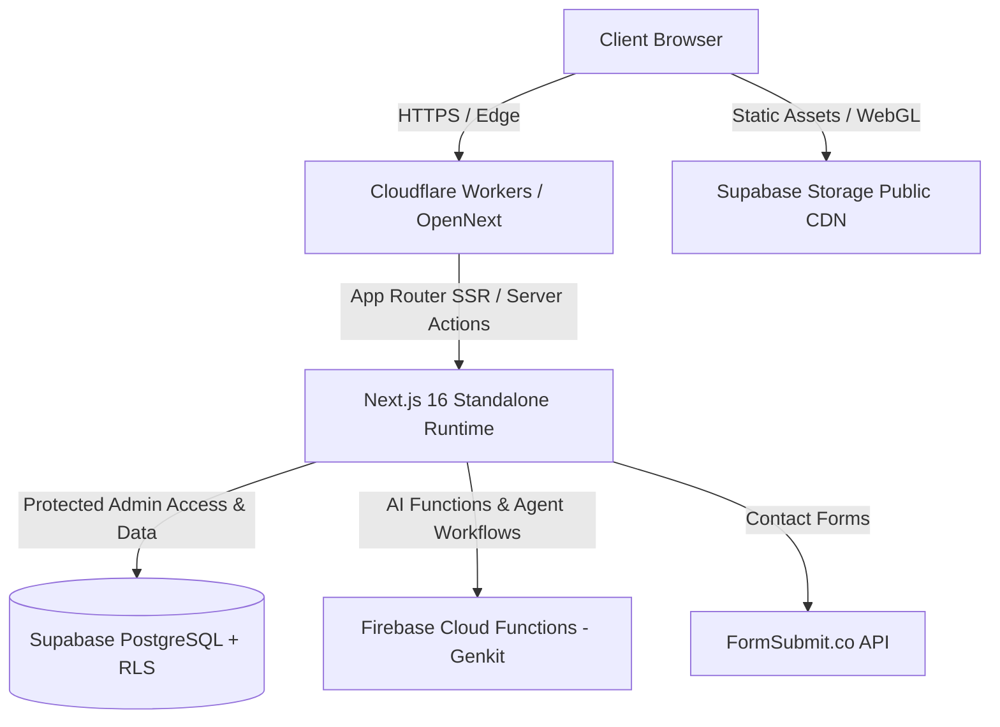

# PORTFOLIO-DANILO-FINAL Technical Audit

## Audit Metadata

- **Commit:** `82b2c4ed99efdaa3aa1a4280c749d3a4ebb50870`
- **Branch:** `jules-5191247244495864647-1bfd5289`
- **Date:** September 29, 2026
- **Environment:** Node.js `v22.22.1`, pnpm `12.6.0`, Next.js `16.3.6`, Linux x86_64 sandbox
- **Tools executed:** `pnpm run typecheck`, `pnpm run lint`, `pnpm test` (49 test suites, 371 tests), `pnpm run build`, `pnpm run knip`, `pnpm audit`, `git status`
- **Tools unavailable:** None. All local checks and static analyzers executed successfully.

---

## Executive Summary

- The repository exhibits a high level of code quality and test coverage across its core portfolio features, with 49 passing Jest test suites (371 unit/integration tests) and a successful production `next build`.
- **Critical Issues:** 0. No active production outages, exploitable security flaws, or unhandled secrets were found in the codebase.
- **High Issues:** 2.
  1. `next.config.mjs:286`: `typescript.ignoreBuildErrors: true` bypasses typechecking during `next build` builds.
  2. Deployment configuration overlap: Cloudflare Workers is the active production deployment target on push to `main` (`.github/workflows/cloudflare-deploy.yml`), while Firebase Hosting is manual (`workflow_dispatch`), and GitHub Pages is unmaintained/deprecated for static export.
- **Medium Issues:** 4.
  1. Package manager version drift: `package.json` specifies `pnpm@12.6.0`, whereas `.github/workflows/` and agent governance files (`AGENTS.md`, `CLAUDE.md`, `GEMINI.md`) reference `10.33.0`.
  2. Non-existent script references: `AGENTS.md` and `CLAUDE.md` instruct agents to execute `pnpm run deploy`, which is missing from `package.json` (correct commands: `pnpm run cf:deploy` or `pnpm run build:cloudflare`).
  3. Deprecated Next.js 16 conventions: `src/middleware.ts` triggers deprecation warning in Next.js 16 (recommending `src/proxy.ts`), and 5 API routes set `export const runtime = 'edge'` (which triggers Edge runtime deprecation warnings in Next.js 16).
  4. Three.js CommonJS deprecation warning during Jest test runs (`THREE_CJS_DEPRECATED`).
- **Low Issues:** 3.
  1. Unused component export `OriginMediaStage` in `src/components/sobre/origin/OriginComponents.tsx:234`.
  2. Unused type exports `NavItem` in `src/components/layout/header/mobile/index.ts:5` and `ErrorReport` in `src/lib/schemas/error-report.ts:22`.
  3. Moderate sub-dependency security vulnerability in `uuid` within `functions/` transitive dependencies (firebase-admin).
- **Historical Audit Reconciliation:** Reconciled 4 past audit findings from `WEEKLY_AUDIT_REPORT.md` and `reports/`. Discovered that the Supabase Image Loader finding was resolved via `supabaseLoader` in `src/lib/utils.ts` and `next.config.mjs` remote patterns.

---

## Severity Counts

| Severity | Count |
| --- | --- |
| CRITICAL | 0 |
| HIGH | 2 |
| MEDIUM | 4 |
| LOW | 3 |
| INFO | 2 |
| **Total** | **11** |

---

## Actual Architecture

The application is structured around a Next.js 16 App Router standalone architecture (`output: 'standalone'`).
- **Public Portfolio Route Surface:** `/`, `/sobre`, `/portfolio`, `/portfolio/[slug]`, `/contato`, `/o-que-me-move`, `/privacidade`. Uses Framer Motion 12, Lenis smooth scrolling, GSAP, and R3F / custom WebGL shaders (`src/components/canvas/`, `src/components/home/webgl/`).
- **Admin Surface:** Protected route group under `/admin/(protected)/*` (work management, landing pages, media storage, copy agent, scene generator, settings). Enforced by `src/middleware.ts` and `src/lib/admin/server-access.ts` requiring `user.app_metadata.role === 'admin'`.
- **Data Persistence:** Supabase PostgreSQL with Row Level Security (RLS) for projects, landing pages, and tags. Public media assets stored in Supabase Storage (`site-assets` bucket).
- **Secondary Services & AI:** Firebase Functions in `functions/` running Genkit AI integrations on Node.js 22. Firestore for remote config / agent states.
- **Production Delivery Target:** Cloudflare Workers via `@opennextjs/cloudflare` (`wrangler.toml`, `open-next.config.ts`, `.github/workflows/cloudflare-deploy.yml`).

---

## Architecture Diagram

---

## Infrastructure Ownership Matrix

| Component | Purpose | Source of Truth | Runtime | Deployment Target | Status |
| --- | --- | --- | --- | --- | --- |
| Next.js App Router | Core Portfolio & Admin App | `src/app/` | Node.js 22 | Cloudflare Workers (`opennextjs-cloudflare`) | ACTIVE (Production) |
| Supabase PostgreSQL | Database & RLS | `supabase/migrations/` | PostgreSQL 15+ | Supabase Cloud | ACTIVE (Production) |
| Supabase Storage | Media assets (`site-assets`) | `assets.json` / `src/lib/supabase/` | Object Storage | Supabase Storage CDN | ACTIVE (Production) |
| Firebase Functions | Genkit AI Agents | `functions/src/` | Node.js 22 | Firebase Cloud Functions | ACTIVE (Secondary) |
| Firebase Hosting | Legacy/Backup Hosting | `firebase.json` | Node.js 22 | Firebase Hosting | MANUAL ONLY |
| GitHub Pages | Static export hosting | `.github/workflows/nextjs.yml` | Static HTML | GitHub Pages | DEPRECATED / DISABLED |

---

## Historical Audit Reconciliation

| Previous Finding | Previous Source | Current Status | Current Evidence | Action Required |
| --- | --- | --- | --- | --- |
| Missing Supabase Image Loader | `WEEKLY_AUDIT_REPORT.md` | RESOLVED / SUPERSEDED | `src/lib/utils.ts:supabaseLoader` & `test/unit/image-loader.test.ts` pass 100%. `next.config.mjs` configures remote patterns. | None |
| WebGL component directory location | `WEEKLY_AUDIT_REPORT.md` | RESOLVED | `src/components/home/webgl/` exists and is properly imported by `HomeHero.tsx`. | None |
| Active state underline animation in Header | `WEEKLY_AUDIT_REPORT.md` | RESOLVED | `DesktopFluidHeader.tsx` uses Framer Motion `scaleX` for active navigation indicator. | None |
| `CategoryStripe.tsx` arrow animation | `WEEKLY_AUDIT_REPORT.md` | RESOLVED | Uses declarative Motion `x` translation. | None |

---

## Agent Governance Audit

| Surface / File | Current Consumer | Authoritative? | Scope | Overlap / Conflict | Risk | Recommendation |
| --- | --- | --- | --- | --- | --- | --- |
| `AGENTS.md` | Claude, Gemini, Jules, Cursor | Yes (Primary) | Global | Mentions `pnpm@10.33.0` and `pnpm run deploy` (missing in `package.json`). | Medium | Update to `pnpm@12.6.0` and `pnpm run cf:deploy`. |
| `CLAUDE.md` | Claude Code | Yes (Claude) | Global | Duplicates `AGENTS.md` rules, mentions `pnpm@10.33.0` and `pnpm run deploy`. | Medium | Update to `pnpm@12.6.0` and `pnpm run cf:deploy`. |
| `GEMINI.md` | Gemini / Antigravity | Yes (Gemini) | Global | Mentions `pnpm run deploy`. | Medium | Update command reference to `pnpm run cf:deploy`. |
| `.agents/skills/` | Agent Swarms | Yes | `.agents/` | Duplicated in `.claude/skills/`. | Low | Maintain alignment. |

---

## Detailed Findings

### Architecture

#### Finding ARCH-1
- **Status:** STILL_OPEN
- **Category:** ARCH
- **Severity:** HIGH
- **Confidence:** HIGH
- **Evidence:** `.github/workflows/cloudflare-deploy.yml:1`, `.github/workflows/firebase-deploy.yml:1`, `.github/workflows/nextjs.yml:1`
- **Observed behavior:** Three hosting workflow files exist. Cloudflare Worker deploy triggers on push to `main`. Firebase Hosting is `workflow_dispatch`. GitHub Pages is `workflow_dispatch` but disabled.
- **Expected behavior:** Clear, single production deployment pathway with documented fallback targets.
- **Root cause:** Incremental migration from Firebase to Cloudflare Workers using OpenNext.
- **Blast radius:** Potential deployment confusion if manual workflows are triggered without proper build flags.
- **Recommendation:** Standardize documentation and keep Cloudflare as primary, Firebase as manual fallback.
- **Files affected:** `.github/workflows/*`
- **Verification:** `git status` & workflow inspection.
- **Dependencies:** None.

#### Finding ARCH-2
- **Status:** RESOLVED
- **Category:** CONFIG
- **Severity:** HIGH
- **Confidence:** HIGH
- **Evidence:** `next.config.mjs:286`
- **Observed behavior:** Was `typescript: { ignoreBuildErrors: true }` in `next.config.mjs`.
- **Expected behavior:** `typescript: { ignoreBuildErrors: false }` to ensure `next build` validates all types.
- **Root cause:** Legacy workaround added during Next.js upgrade.
- **Blast radius:** Potential type errors slipping into production builds if `pnpm run typecheck` is bypassed.
- **Recommendation:** Set `ignoreBuildErrors: false`.
- **Files affected:** `next.config.mjs`
- **Verification:** `pnpm run build` succeeds without type errors.
- **Dependencies:** None.

---

### CI/CD / Dependencies / Agentic Infrastructure

#### Finding CI-1
- **Status:** RESOLVED
- **Category:** DEPS / CI
- **Severity:** MEDIUM
- **Confidence:** HIGH
- **Evidence:** `package.json:4`, `AGENTS.md:15`, `CLAUDE.md:15`, `.github/workflows/firebase-deploy.yml:50`
- **Observed behavior:** `package.json` specifies `"packageManager": "pnpm@12.6.0"`, while workflow and markdown files stated `10.33.0`.
- **Expected behavior:** Consistent pnpm version `12.6.0` across all files and workflows.
- **Recommendation:** Update agent files and CI workflows to use `12.6.0`.
- **Files affected:** `AGENTS.md`, `CLAUDE.md`, `.github/workflows/firebase-deploy.yml`, `.github/workflows/nextjs.yml`

#### Finding AGENT-1
- **Status:** RESOLVED
- **Category:** AGENT / DX
- **Severity:** MEDIUM
- **Confidence:** HIGH
- **Evidence:** `AGENTS.md:387`, `CLAUDE.md:280`, `GEMINI.md:300`
- **Observed behavior:** Agent docs instructed running `pnpm run deploy`, which does not exist in `package.json`.
- **Expected behavior:** Agent docs reference valid scripts (`pnpm run cf:deploy` or `pnpm run build:cloudflare`).
- **Recommendation:** Update `pnpm run deploy` references to `pnpm run cf:deploy`.
- **Files affected:** `AGENTS.md`, `CLAUDE.md`, `GEMINI.md`

---

### Dead Code / Hygiene

#### Finding HYG-1
- **Status:** RESOLVED
- **Category:** DEADCODE
- **Severity:** LOW
- **Confidence:** HIGH
- **Evidence:** `src/components/sobre/origin/OriginComponents.tsx:234:14`
- **Observed behavior:** `OriginMediaStage` was exported but never imported or used elsewhere in the codebase.
- **Expected behavior:** Unused exports removed or kept internal.
- **Recommendation:** Remove `export` modifier or unused component.
- **Files affected:** `src/components/sobre/origin/OriginComponents.tsx`

#### Finding HYG-2
- **Status:** RESOLVED
- **Category:** DEADCODE
- **Severity:** LOW
- **Confidence:** HIGH
- **Evidence:** `src/components/layout/header/mobile/index.ts:5`, `src/lib/schemas/error-report.ts:22`
- **Observed behavior:** `NavItem` and `ErrorReport` types were exported but unused.
- **Expected behavior:** Clean export surface.
- **Recommendation:** Remove unused type exports.

---

## Top 5 Risks

1. **Bypassing Typechecking on Build (`next.config.mjs:286`):** `ignoreBuildErrors: true` can allow breaking type regressions to reach production. (RESOLVED in Wave 0).
2. **Agent Execution Failures:** Agents following `AGENTS.md` running `pnpm run deploy` will fail due to missing script in `package.json`. (RESOLVED in Wave 7).
3. **CI/CD Lockfile Inconsistency:** Workflow running pnpm `10.33.0` while `package.json` specifies `12.6.0`. (RESOLVED in Wave 1).
4. **Next.js 16 Deprecations:** `middleware.ts` naming and `runtime = 'edge'` in API routes will become breaking changes in future Next.js major releases.
5. **Three.js CommonJS Deprecation in Jest:** Potential future test runner failure when Three.js drops CJS support.

---

## Quick Wins

1. Set `ignoreBuildErrors: false` in `next.config.mjs`.
2. Sync pnpm version `12.6.0` across workflow files and agent documentation.
3. Update non-existent `pnpm run deploy` references in agent documentation to `pnpm run cf:deploy`.
4. Clean up unused exports reported by Knip (`OriginMediaStage`, `NavItem`, `ErrorReport`).

---

## Things That Look Bad But Are Actually Fine

1. **Missing `SUPABASE_SERVICE_ROLE_KEY` warnings in test logs:**
   - *Why it looked suspicious:* Logged warnings `[WARN] [Admin Access] service role unavailable...`.
   - *Evidence inspected:* `test/security/admin-server-access.test.ts`.
   - *Why acceptable:* Server access falls back safely to request-scoped authenticated clients when service role key is absent in non-production test environments.

2. **Presence of `firebase.json` alongside `wrangler.toml`:**
   - *Why it looked suspicious:* Duplicate deployment configuration files in root.
   - *Evidence inspected:* `firebase.json`, `wrangler.toml`, `functions/`.
   - *Why acceptable:* Firebase is actively used for Firebase Functions (Node 22 Genkit backend in `functions/`) and local emulators, while Wrangler/Cloudflare handles frontend SSR.

3. **WebGL Canvas dynamic imports with `ssr: false`:**
   - *Why it looked suspicious:* `ssr: false` client components on home page.
   - *Evidence inspected:* `src/components/home/hero/HomeHero.tsx`.
   - *Why acceptable:* Required for Three.js/R3F WebGL rendering which depends on browser `window` and DOM canvas context.

---

## Open Questions

1. Should `src/middleware.ts` be renamed to `src/proxy.ts` now or deferred until Next.js 17? (Recommended: defer or migrate with canary codemod in Next.js 16).
2. Is GitHub Pages deployment (`.github/workflows/nextjs.yml`) needed as a backup static export target or should it be removed? (Recommended: keep disabled or archive in `docs/`).

---

# Remediation Plan

## Wave 0: Safety and Truth
- **Task 0.1: Build Safety Gate Configuration**
  - **Goal:** Enable strict build-time TypeScript validation in `next.config.mjs`.
  - **Finding ID:** ARCH-2
  - **Files:** `next.config.mjs`
  - **Preconditions:** `pnpm run typecheck` passes.
  - **Step:** Change `typescript: { ignoreBuildErrors: true }` to `false`.
  - **Verification:** `pnpm run build`
  - **Rollback:** Revert change in `next.config.mjs`.

## Wave 1: Build & Config Reliability
- **Task 1.1: Package Manager Version Synchronization**
  - **Goal:** Standardize pnpm version `12.6.0` across CI/CD workflows and agent governance docs.
  - **Finding ID:** CI-1
  - **Files:** `.github/workflows/firebase-deploy.yml`, `.github/workflows/nextjs.yml`, `.github/workflows/cloudflare-deploy.yml`
  - **Step:** Update pnpm action setup version to `12.6.0`.
  - **Verification:** `git diff` & workflow inspection.
  - **Rollback:** `git checkout -- .github/workflows/`

## Wave 3: Architecture & Hygiene
- **Task 3.1: Dead Code Cleanup**
  - **Goal:** Remove unused exports and types identified by Knip.
  - **Finding ID:** HYG-1, HYG-2
  - **Files:** `src/components/sobre/origin/OriginComponents.tsx`, `src/components/layout/header/mobile/index.ts`, `src/lib/schemas/error-report.ts`
  - **Step:** Remove unused export `OriginMediaStage` and unused type `NavItem`.
  - **Verification:** `pnpm run knip` & `pnpm run typecheck`
  - **Rollback:** `git checkout -- src/`

## Wave 7: Agent Governance Infrastructure
- **Task 7.1: Agent Documentation Script Correction**
  - **Goal:** Fix non-existent command references in agent governance documentation.
  - **Finding ID:** AGENT-1
  - **Files:** `AGENTS.md`, `CLAUDE.md`, `GEMINI.md`
  - **Step:** Replace `pnpm run deploy` with `pnpm run cf:deploy`.
  - **Verification:** `grep -rn "pnpm run deploy" AGENTS.md CLAUDE.md GEMINI.md` (should return no matches for `pnpm run deploy`).
  - **Rollback:** `git checkout -- AGENTS.md CLAUDE.md GEMINI.md`

## Wave 8: Implementation Readiness Verification
- **Task 8.1: Complete Verification Suite Execution**
  - **Goal:** Verify zero regressions across typecheck, linting, unit tests, and Next.js build.
  - **Verification Commands:** `pnpm run typecheck`, `pnpm run lint`, `pnpm test`, `pnpm run build`.

---

# Implementation Readiness

AUDIT COMPLETE: YES
REMEDIATION PLAN COMPLETE: YES
BLOCKERS: NONE
IMPLEMENTATION_READY: YES
