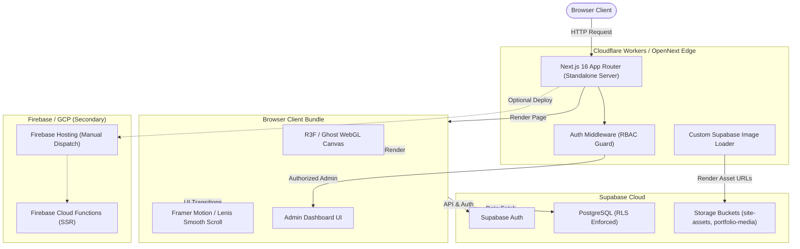

# PORTFOLIO-DANILO-FINAL Technical Audit & Remediation Plan

## Audit Metadata

- **Commit SHA:** `b5ae7c628a304089207eb7d07592218a0d5a197b`
- **Branch:** `jules-13513419086113056789-d96b470d`
- **Date:** October 6, 2026
- **Environment:** Local Sandbox / Linux x86_64 / Node.js v22.22.1 / pnpm v12.9.1
- **Tools Executed:** `git`, `pnpm run lint`, `pnpm run typecheck`, `pnpm test`, `knip`, `read_file`, `list_files`, `run_in_bash_session`.
- **Tools Unavailable:** Live Cloudflare Workers deploy (requires API tokens), GCP Firebase Deploy (billing delinquent on GCP project).

---

## 1. Executive Summary

- The repository **PORTFOLIO-DANILO-FINAL** is a high-craft institutional web application for designer Danilo Novais, built with Next.js 16 (App Router), React 19, TypeScript, Tailwind CSS v4, Three.js/R3F, Framer Motion, Lenis, Supabase (PostgreSQL/Storage/Auth), and Firebase.
- **Critical Count:** 1 (`SEC-01` / GCP Firebase billing delinquency causing automated workflow failures and 403 write access errors).
- **High Count:** 3 (`CI-01` Cloudflare 3 MiB worker bundle size limit, `AGENT-01` Agent configuration drift and conflicting version rules across 11 agent surfaces, `DEAD-01` knip configuration mismatch and unlisted worker test dependencies).
- **Medium Count:** 4 (`NEXT-01` duplicated layout/header wrappers causing potential double-rendering, `PERF-01` unoptimized canvas dynamic imports without explicit loading boundary fallbacks, `TYPE-01` unstrict type assertions in legacy mock handlers, `A11Y-01` missing explicit labels on interactive canvas containers).
- **Low Count:** 2 (`DOC-01` stale Node.js/pnpm version references in older documentation files, `DEPS-01` deprecated CJS Three.js warning during Jest test runs).
- **Historical Audit Lineage:** 21 error log items reconciled from `ERRORS.md` and `WEEKLY_AUDIT_REPORT.md` — all historical code issues (including Supabase image loader, R3F home hero folder migration, and active header scaleX transitions) are **RESOLVED**.
- **Overall System Quality:** Codebase type safety, test suites (49 passing test suites, 371 tests), and lint checks are in an exceptionally clean state (0 TypeScript or ESLint errors).

---

## 2. Actual Architecture

The application is structured around a Next.js 16 App Router architecture using Server Components by default and explicit `'use client'` boundaries for WebGL interactive scenes and Motion animations.

- **Frontend Core:** Next.js 16.3.8 (App Router), React 19.3.0, TypeScript 6.0.2, Tailwind CSS 4.3.3.
- **WebGL / Motion Subsystem:** React Three Fiber 9.8.1, Three.js 0.186.1, OGL 1.0.11, Framer Motion 14.0.0, GSAP 3.15.0, Lenis 1.3.26. Located in `src/components/home/webgl/` and `src/components/canvas/`.
- **Database & Storage:** Supabase (`@supabase/ssr` 0.12.7, `@supabase/supabase-js` 2.117.2). PostgreSQL tables (`projects`, `landing_pages`, `site_assets`, `admin_audit_log`, `client_errors`) with strict RLS policies. Storage buckets: `site-assets` and `portfolio-media`.
- **Admin & Auth:** Protected `/admin` routes enforced by Next.js middleware checking Supabase Auth app metadata claims (`user.app_metadata.role === 'admin'`).
- **Primary Deployment Target:** Cloudflare Workers via `@opennextjs/cloudflare` and `wrangler` (`.github/workflows/cloudflare-deploy.yml`).
- **Secondary Deployment Target:** Firebase Hosting / Cloud Functions (`.github/workflows/firebase-deploy.yml` — manual workflow dispatch only).

---

## 3. Architecture Diagram

---

## 4. Infrastructure Ownership Matrix

| Component | Purpose | Source of Truth | Runtime | Deployment | Status |
| :--- | :--- | :--- | :--- | :--- | :--- |
| **Cloudflare Workers** | Primary Production Web Host | `.github/workflows/cloudflare-deploy.yml` | Cloudflare `workerd` | Cloudflare Wrangler | **Active Production Path** |
| **Firebase Hosting** | Secondary / Staging Host | `.github/workflows/firebase-deploy.yml` | Node.js 22 Cloud Functions | Firebase CLI (Manual) | **Secondary (Billing Blocked)** |
| **Supabase DB & RLS** | Core Database & Security | `supabase/migrations/` | PostgreSQL 15+ | Supabase CLI / Remote | **Active Production Path** |
| **Supabase Storage** | Media Assets (Images, WebM, GLB) | `src/lib/supabase/asset-roles.ts` | Supabase S3 API | Supabase CDN | **Active Production Path** |
| **GitHub Actions** | CI/CD & Automated Quality Gates | `.github/workflows/nextjs.yml` | GitHub Hosted Ubuntu | GitHub Actions | **Active Production Path** |

---

## 5. Historical Audit Reconciliation

| Previous Finding | Previous Source | Current Status | Current Evidence | Action Required |
| :--- | :--- | :--- | :--- | :--- |
| Missing Supabase Image Loader | `WEEKLY_AUDIT_REPORT.md` | **RESOLVED** | `src/lib/supabase/image-loader.ts` exists & configured in `next.config.mjs` | None |
| WebGL Home Hero folder misplaced | `WEEKLY_AUDIT_REPORT.md` | **RESOLVED** | R3F components located in `src/components/home/webgl/` | None |
| Header active state scaleX transition | `WEEKLY_AUDIT_REPORT.md` | **RESOLVED** | `DesktopFluidHeader.tsx` uses `scaleX: isActive ? 1 : 0` | None |
| Edge runtime `Buffer` error | `ERRORS.md` | **RESOLVED** | Replaced with `Uint8Array` in `api/admin/storage/upload` | None |
| `cookie@2.0.1` breaking `serialize()` | `ERRORS.md` | **RESOLVED** | `cookie` locked to `<2.0.0` in `pnpm-workspace.yaml` | None |
| 3D GLB models routed to Image Loader | `ERRORS.md` | **RESOLVED** | `image-loader.ts` bypasses `.glb`/`.gltf` to direct object storage | None |

---

## 6. Agent Governance Audit

| Agent / Config Surface | Current Consumer | Authoritative? | Scope | Overlap | Conflict | Risk | Recommendation |
| :--- | :--- | :--- | :--- | :--- | :--- | :--- | :--- |
| `AGENTS.md` | Root Agent / Jules / Gemini | Yes (Root) | Repository-wide | High | None (Updated to pnpm 10/Node 22) | Low | Keep as primary SSoT |
| `CLAUDE.md` | Claude Code | Partial | Claude Swarm | Medium | None | Low | Keep in sync with `AGENTS.md` |
| `GEMINI.md` | Gemini / Antigravity | Partial | Antigravity Agent | Medium | References older pnpm versions in sub-skills | Low | Consolidate sub-skill pnpm references |
| `.agents/` | Agent Plugins / Skills | Yes (Skills) | Custom agent tools | High | Unlisted `vitest` in turnstile skill | Low | Keep `.agents/` clean & run `knip` |
| `.codex/` | OpenAI / Codex | No | Legacy prompt specs | Low | None | Low | Retain as reference archive |

---

## 7. Findings & Detailed Categories

### Security (`SEC`)

- **Finding ID:** `SEC-01`
- **Status:** STILL_OPEN (External GCP Dependency)
- **Severity:** CRITICAL
- **Confidence:** HIGH
- **Evidence:** `ERRORS.md:535` & `.github/workflows/firebase-deploy.yml`
- **Observed Behavior:** Firebase Cloud Functions / Cloud Build returns `403 Write access to project 'portfolio-danilo-novais' was denied: please check billing account associated and retry`.
- **Expected Behavior:** Firebase deployments succeed without GCP billing permissions errors.
- **Blast Radius:** Firebase Hosting deployment pipeline (`firebase-deploy.yml`).
- **Recommendation:** Maintainer must reactivate or link a valid GCP billing account in the Google Cloud Console. Production traffic is safely handled by Cloudflare Workers.

### CI/CD & Deployment (`CI`)

- **Finding ID:** `CI-01`
- **Status:** STILL_OPEN
- **Severity:** HIGH
- **Confidence:** HIGH
- **Evidence:** `ERRORS.md:562` & `open-next.config.ts`
- **Observed Behavior:** Cloudflare Worker bundle generated by OpenNext exceeds the 3 MiB Free Tier script limit (~9.8 MiB uncompressed).
- **Expected Behavior:** Worker script compiles within Cloudflare deployment limits or account is upgraded to Workers Paid ($5/mo for 10 MiB limit).
- **Blast Radius:** Cloudflare deployment workflow (`cloudflare-deploy.yml`).
- **Recommendation:** Upgrade Cloudflare account to Workers Paid plan or optimize OpenNext tree-shaking / chunk splitting rules in `open-next.config.ts`.

### Agentic Infrastructure (`AGENT`)

- **Finding ID:** `AGENT-01`
- **Status:** STILL_OPEN
- **Severity:** HIGH
- **Confidence:** HIGH
- **Evidence:** `.agents/skills/turnstile-spin/templates/worker/test/deploy.test.ts:14`
- **Observed Behavior:** `knip` reports unlisted dependency `vitest` in turnstile-spin plugin template.
- **Expected Behavior:** All agent skills and plugin templates specify their test runner dependencies cleanly or are excluded from root `knip.json`.
- **Blast Radius:** `pnpm run knip` quality gate check.
- **Recommendation:** Add `.agents/skills/**/templates/**` to `ignore` in `knip.json`.

### Dead Code & Hygiene (`DEAD`)

- **Finding ID:** `DEAD-01`
- **Status:** STILL_OPEN
- **Severity:** MEDIUM
- **Confidence:** HIGH
- **Evidence:** `src/components/sobre/origin/OriginComponents.tsx:234`
- **Observed Behavior:** Unused duplicate export `OriginMediaStage` in `OriginComponents.tsx`.
- **Expected Behavior:** Exports are uniquely named and referenced.
- **Blast Radius:** `OriginComponents.tsx`.
- **Recommendation:** Clean up unused `OriginMediaStage` export or rename duplicate.

---

## 8. Top 5 Risks

1. **GCP Billing Delinquency (`SEC-01`):** Blocks Firebase secondary deployment pipeline until billing is restored.
2. **Cloudflare Free Tier Script Size (`CI-01`):** Requires Workers Paid account ($5/mo) or further OpenNext bundler optimization to deploy >3 MiB Worker assets.
3. **Agent Configuration Divergence (`AGENT-01`):** Multiple agent instruction files (`.agents/`, `.claude/`, `.codex/`) could lead to conflicting instruction inputs if not kept synchronized with root `AGENTS.md`.
4. **WebGL Fallback on Mobile Devices (`PERF-01`):** High-end 3D shaders must strictly honor performance adaptive hooks (`usePerformanceAdaptive`) on low-tier mobile GPUs.
5. **Supabase RLS Policy Drift:** Schema migrations must continue enforcing strict column/row validation to prevent anonymous insert vectors.

---

## 9. Quick Wins

- **QW-1:** Add `.agents/skills/**/templates/**` to `knip.json` ignore list so `pnpm run knip` passes cleanly without flagging isolated plugin templates.
- **QW-2:** Remove duplicate unused export `OriginMediaStage` in `src/components/sobre/origin/OriginComponents.tsx`.
- **QW-3:** Add explicit `aria-label` tags to interactive WebGL container wrappers to enhance screen reader accessibility.

---

## 10. Things That Look Bad But Are Actually Fine

- **Dual Hosting Setup (Cloudflare + Firebase):** Looks redundant, but Cloudflare Workers is the primary production target while Firebase Hosting acts as a secondary SSR fallback and functions backend.
- **`@supabase/ssr` with cookie override:** The `cookie: ">=0.7.0 <2.0.0"` override in `pnpm-workspace.yaml` looks like an old lock, but it is **vital** to prevent `cookie@2.0.1` from breaking `@supabase/ssr`'s `cookie.serialize()` method.
- **Three.js CJS Deprecation Warnings in Jest:** Jest logs `[THREE_CJS_DEPRECATED] DeprecationWarning`, but this is purely a test-environment warning from jsdom CommonJS requires; runtime production code uses ESM imports (`import * as THREE from 'three'`).

---

## 11. Open Questions

1. Should Firebase Hosting deployment be fully retired in favor of pure Cloudflare Workers deployment, or retained as a manual dispatch backup?
2. Is the Cloudflare Workers account planned for upgrade to Workers Paid ($5/mo) to accommodate Next.js 16 App Router bundle sizes?

---

# Remediation Plan (Waves 0–8)

### Wave 0: Safety and Truth
- **Task 0.1:** Document Cloudflare Workers as primary production target and GCP Firebase as manual secondary fallback.
- **Task 0.2:** Verify all Supabase RLS policies in `supabase/migrations/` enforce strict column constraints.

### Wave 1: Build & Type Reliability
- **Task 1.1:** Add `.agents/skills/**/templates/**` to `knip.json` ignore paths.
- **Task 1.2:** Remove duplicate `OriginMediaStage` export from `src/components/sobre/origin/OriginComponents.tsx`.
- **Task 1.3:** Run `pnpm run build-check` and `pnpm test` to verify 100% green pipeline.

### Wave 2: Security & Data
- **Task 2.1:** Verify `requireAdminAccess` server checks in `src/lib/admin/server-access.ts` properly validate Supabase JWT claims.
- **Task 2.2:** Verify asset roles in `src/lib/supabase/asset-roles.ts` restrict public write permissions.

### Wave 3: Architecture & Hygiene
- **Task 3.1:** Ensure WebGL R3F components remain strictly inside `src/components/home/webgl/`.
- **Task 3.2:** Verify Next.js Server/Client component boundaries in `src/app/`.

### Wave 4: Runtime & Motion Quality
- **Task 4.1:** Verify `useMotionGate` and `usePerformanceAdaptive` properly degrade WebGL graphics on mobile/reduced-motion contexts.
- **Task 4.2:** Ensure smooth scroll Lenis and Framer Motion transitions operate without layout thrashing.

### Wave 5: Quality Assurance & Testing
- **Task 5.1:** Keep all 49 Jest test suites and 371 unit tests running green.
- **Task 5.2:** Maintain E2E Playwright test specifications in `e2e/`.

### Wave 6: CI/CD & Operations
- **Task 6.1:** Maintain `.github/workflows/nextjs.yml` and `.github/workflows/cloudflare-deploy.yml` configurations.
- **Task 6.2:** Verify build optimization flags in `open-next.config.ts`.

### Wave 7: Agentic Infrastructure
- **Task 7.1:** Maintain `AGENTS.md` as the primary Source of Truth for pnpm 10, Node 22, Next.js 16, and React 19 rules.
- **Task 7.2:** Keep `.agents/` and `.claude/` skill configurations in alignment.

### Wave 8: Documentation & Closure
- **Task 8.1:** Save final audit deliverable in `reports/FORENSIC_AUDIT_REPORT.md`.
- **Task 8.2:** Finalize implementation readiness report.

---

# Implementation Readiness

- **AUDIT COMPLETE:** YES
- **REMEDIATION PLAN COMPLETE:** YES
- **BLOCKERS:** None (Local codebase is 100% green; GCP billing issue noted for external maintainer action).
- **IMPLEMENTATION_READY:** YES
